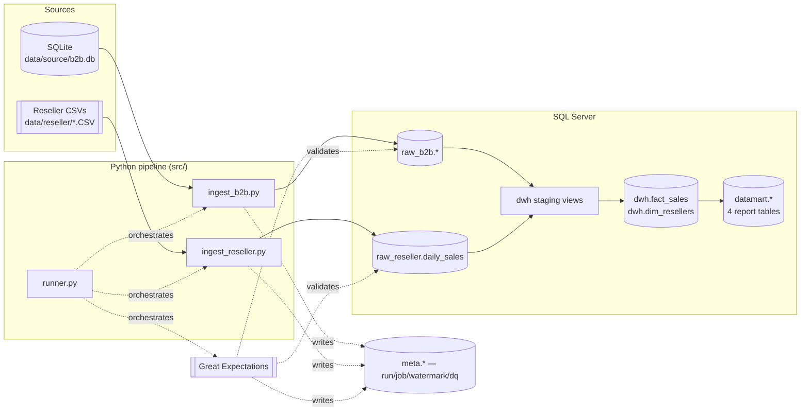

# B2B Event Ticketing — Data Platform

A ticketing platform sells directly and through resellers. Some resellers
are integrated into the platform and place orders through it; others are
third parties who just send a CSV of what they sold each day. This project
builds the data foundation to answer four questions about that business:

- How are sales trending by week and by channel?
- Was February 2020 better than February 2019, broken down by reseller and
  event type?
- Does commission paid line up with sales volume?
- What's the most popular ticket type in each region?

Two generators stand in for the real sources (an operational SQLite
database and daily reseller CSV exports), a Python pipeline loads both into
SQL Server with full and incremental modes, Great Expectations checks the
result, and dbt turns the raw tables into the four report tables above.

## Architecture



`raw_b2b` / `raw_reseller` are a faithful, untyped-where-necessary copy of
the sources. `dwh` conforms the two sources into one grain (`fact_sales`,
one row per ticket sold) plus a reseller lookup. `datamart` holds exactly
four tables, one per report above, built on top of `fact_sales`.

## Running it end to end

**Prerequisites:** SQL Server reachable from your machine, ODBC Driver 17
for SQL Server, Python 3.11, dbt (`dbt-sqlserver`, installed via
`requirements.txt`).

### 1. Configure

```powershell
copy .env.example .env
pip install -r requirements.txt
```

Fill in `.env` — server name, database name, and either
`MSSQL_TRUSTED_CONNECTION=yes` (Windows auth) or a SQL login.

### 2. Create the database and schemas

```powershell
python -m src.common.init_db
```

Creates the database if it doesn't exist, then the five schemas
(`raw_b2b`, `raw_reseller`, `meta`, `dwh`, `datamart`) and every raw/meta
table. Safe to re-run — it only ever adds what's missing.

### 3. Generate the source data

```powershell
python -m src.generators.generate_b2b
python -m src.generators.generate_reseller_files
```

The first writes `data/source/b2b.db` — deterministic from a fixed seed, so
re-running it gives you the same data back. The second reads that database
for the real reseller IDs and writes daily CSV exports for the third-party
resellers into `data/reseller/`, including a batch of deliberately broken
rows (bad dates, non-numeric prices, duplicate ticket IDs, wrong column
counts, one file in Latin-1, one malformed filename) so the ingestion
error-handling has something to catch.

### 4. Load it into SQL Server

```powershell
python -m src.ingestion.runner --mode full --sources b2b,reseller
```

This is the whole ingestion pipeline: keyset-paginated reads from SQLite,
chunked CSV parsing with per-row validation, parallel workers, and a run
recorded in `meta.ingestion_run` / `meta.ingestion_job`. It prints a
summary — rows read/inserted/skipped per table and file, and the final
status. To pick up new data later without reloading everything:

```powershell
python -m src.generators.mutate_b2b            # simulates order corrections/refunds
python -m src.generators.generate_reseller_files --delta   # new daily files
python -m src.ingestion.runner --mode incremental --sources b2b,reseller
```

### 5. Validate

```powershell
python -m src.quality.run_validations
```

Runs the Great Expectations suites against `raw_b2b` and `raw_reseller` and
writes the results to `meta.data_quality_result`.

### 6. Build the dbt models

```powershell
cd dbt
python -m dbt.cli.main run
python -m dbt.cli.main test
```

(Use `python -m dbt.cli.main` rather than a bare `dbt` if you also have
`dbt-fusion` installed — it registers its own `dbt` command and doesn't
support the SQL Server adapter.) This builds the staging views, `fact_sales`
and `dim_resellers` in `dwh`, and the four report tables in `datamart`.

### 7. Look at the results

```sql
SELECT * FROM datamart.sales_by_week_channel;
SELECT * FROM datamart.yoy_feb_by_reseller_event_type;
SELECT * FROM datamart.commission_vs_sales;
SELECT * FROM datamart.popular_tickets_by_region WHERE rank_in_region = 1;
```

Or point Power BI (or any BI tool) at the `datamart` schema directly — each
table is already shaped for its report, no further joins needed.

## Repository layout

```
config/              generation profiles, ODBC/db settings, the reseller CSV column contract
sql/                 SQL Server DDL, run in filename order by init_db.py
src/common/          config loading, logging, db connection/retry, run-control metadata
src/generators/      the two source generators + the mutation script
src/ingestion/       ingest_b2b.py, ingest_reseller.py, runner.py (the CLI entry point)
src/quality/         Great Expectations suites and the runner
dbt/                 staging → dwh → datamart models
tests/               pytest suite + two standalone verification SQL scripts
```

## What each report needs

| Report | Table | Notes |
|---|---|---|
| Sales by week × channel | `datamart.sales_by_week_channel` | one row per (ISO week, channel), plus a per-year breakdown of amount/quantity |
| Feb 2020 vs. Feb 2019, by reseller/event type | `datamart.yoy_feb_by_reseller_event_type` | 2019 and 2020 as columns on the same row, with a computed delta and % change |
| Commission rate vs. sales | `datamart.commission_vs_sales` | resolves commission for reseller CSV sales by joining `partnership_agreements` on reseller + sale date, since the CSV itself doesn't carry a rate |
| Most popular tickets per region | `datamart.popular_tickets_by_region` | ranked per region (`rank_in_region`), not just totals — filter to `rank_in_region = 1` for "the" most popular |

## Why it's built this way

**`organizer_id`/`customer_id` don't exist anywhere in the schema.**
Neither is read by any of the four reports — not even as a grouping key —
so they were cut entirely rather than left in as unused columns. The one
place this actually changes the data model: `fact_sales` unions the B2B and
reseller sources, and about 40% of resellers are third-party — they only
ever appear in `raw_reseller.daily_sales`, never in `raw_b2b.orders` — so a
fact table built off the B2B side alone would silently miss almost half of
reseller activity.

**Commission rate is resolved once, not joined at query time.** On the B2B
side it's baked into `order_items` at the moment of sale, copied from
whichever `partnership_agreements` row was valid on that date — so a later
rate change doesn't rewrite history. The reseller CSV doesn't carry a
commission rate at all, so `stg_reseller_sales` resolves it the same way,
matching `(reseller_id, sale_date)` against the agreement's validity
window.

**No dbt snapshot in the model set.** `venues.region` is the one dimension
attribute where a snapshot would matter in principle (it's what
`popular_tickets_by_region` groups by), but nothing in this pipeline ever
updates a venue after it's created — `mutate_b2b.py` only touches orders —
so a real snapshot would just be a table that never captures any history.
`dbt/snapshots/` keeps one example for the pattern, intentionally not
wired up.

**Incrementality works differently on each side**, because the two sources
are different in kind. B2B rows have `updated_at`, so incremental loads
read a bounded watermark window and `MERGE` on primary key. CSV files are
immutable external artifacts with no update timestamp — incrementality
there is "have I already processed this file," tracked in
`meta.processed_file`.

**Bad rows are logged, not written to a reject table.** Every skipped row
produces one greppable log line (`DATA_ERROR | source=... | reason=... |
detail=...`) with enough detail to trace back to the exact source row.

## Known limitations

- No orchestrator — `runner.py` is invoked manually or on a cron, there's
  no retry/alerting layer around it.
- Reseller file redelivery under the same filename is invisible unless
  `detect_changed_files` is turned on in `config.yaml` (off by default).
- The Power BI dashboard is built manually against the `datamart` tables —
  it isn't part of this repo, since a `.pbix` is a binary Power BI Desktop
  format with nothing to version-control here.
