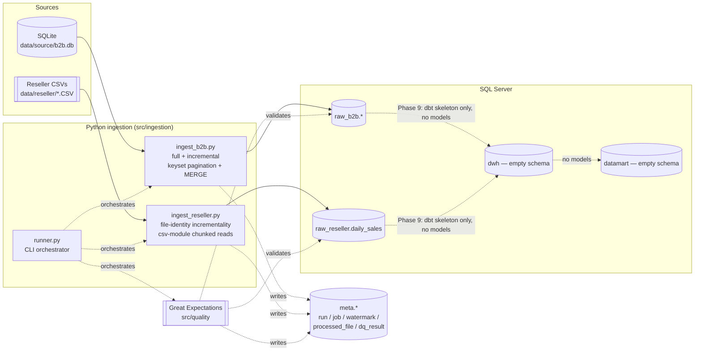

# B2B Event Ticketing — Data Platform

Ingestion foundation for a B2B event-ticketing data platform: two generated
sources (a SQLite "operational" database and daily reseller CSV exports)
land in a SQL Server `raw` layer through a Python pipeline that supports
full and incremental loads, chunking, parallelism, restartability, error
logging, and processing metadata. `dwh` and `datamart` exist as empty
schemas plus a dbt skeleton — no dimensional modeling is in scope here (see
[Scope](#scope-and-known-limitations)).

> **Read this first:** this repository was built in a sandboxed dev
> environment with **no reachable SQL Server instance and no Microsoft ODBC
> driver installed**. Phases 1-3 (config, logging, the two generators) were
> built *and verified by actually running them* here. Everything from
> Phase 4 on that talks to SQL Server was built to spec, exercised as far as
> this sandbox allows (see [Verification approach](#verification-approach-in-this-sandbox)),
> and needs one real run against a live instance to close the loop — the
> commands below are exactly what to run to do that. Full detail on every
> verification step taken is in [`NOTES.md`](NOTES.md).

## What this is

A reproducible, from-scratch data platform build: deterministic fake data
generators stand in for a B2B ticketing platform's operational database and
its third-party resellers' daily CSV exports, and a Python pipeline loads
both into a SQL Server `raw` layer with the operational characteristics a
real ingestion system needs — incrementality, restartability, bounded
memory, parallelism, and traceable error handling — all driven by config,
not hardcoded values. Great Expectations validates the result and every run
is fully auditable from `meta.*` tables, so a reviewer can answer "did this
work, and how do I know" without reading logs.

## Quick start

**Prerequisites:** a reachable SQL Server instance, ODBC Driver 17 for SQL
Server, Python 3.11.

```bash
cp .env.example .env            # fill in MSSQL_SERVER / credentials
pip install -r requirements.txt
make init-db                    # creates the database + all schemas/tables
make gen-b2b && make gen-files  # generate both sources
make ingest-full                # load everything into raw
```

Then verify:

```bash
make dq                         # Great Expectations against the raw layer
```

## Architecture



## Requirement traceability

| Requirement | Where it lives | How to demonstrate |
|---|---|---|
| Initial load | `src/ingestion/ingest_b2b.py`, `ingest_reseller.py` (full mode) | `make ingest-full` |
| Restartable | B2B: watermark checkpoint (`meta.watermark`, advanced only after every chunk commits); reseller: `meta.processed_file` status + delete-and-reload | Kill mid-run, re-run — counts still match, no duplicates (`tests/verification.sql` §5) |
| Handle erroneous data | Per-row validation, `DATA_ERROR` log lines (`src/common/logging_setup.py::data_error`), `max_skip_ratio` (B2B) | `grep DATA_ERROR logs/*.log \| grep -oP 'reason=\K[a-z_]+' \| sort \| uniq -c` |
| Processing metadata | `meta.ingestion_run` / `ingestion_job` / `processed_file` / `watermark` | `tests/verification.sql` §2-3, or the runner's own summary output |
| Readable format for reporting | Typed `raw_b2b.*` (proper DECIMAL/DATETIME2 types); `dbt/models/sources/sources.yml` declares both raw schemas | `tests/verification.sql` §7 (R1-R4) |
| Large data | Keyset pagination (never OFFSET), chunked CSV reads (bounded memory, `csv` module + manual batching), `fast_executemany=True`, parallel workers | `run.profile: large` in `config.yaml`, `--profile-memory` flag |
| Incremental load | B2B: `updated_at` watermark, bounded at `high_bound = utcnow()` captured once per job; reseller: file-registry (`meta.processed_file`) | `make ingest-incr` after `make gen-files-delta` + `python -m src.generators.mutate_b2b` — `rows_read` is a small fraction of the full run's (`tests/verification.sql` §4) |
| Data quality | `src/quality/` — 4 Great Expectations suites (3 from spec + an orphan-check suite, see [NOTES.md](NOTES.md)) | `make dq`; `meta.data_quality_result` |
| Infrastructure overview | This README; `.env.example` / `config/config.yaml` | — |

## Design decisions and trade-offs

- **The reseller raw layer is all-`NVARCHAR(255)`.** Files land as text,
  unmodified; typing and cleansing are a `dwh` concern (out of scope here).
  This keeps `raw_reseller.daily_sales` a faithful, lossless copy of
  whatever a reseller actually sent — including the malformed rows — so a
  reviewer can always see the original value next to why it was rejected.
- **File identity, not `updated_at`, drives reseller incrementality.**
  CSV exports are immutable external artifacts with no update timestamp;
  "have I already processed this file?" (`meta.processed_file`, keyed on
  file name) is the only sound definition of "new work" for a file-based
  source. See NOTES.md for the corollary limitation: a same-named corrected
  redelivery is invisible unless `detect_changed_files: true`.
- **`commission_rate` is snapshotted onto `order_items` at sale time**,
  copied from whichever `partnership_agreements` row was valid on the order
  date, rather than resolved by a join at query time. Agreements change
  rates over time; a join-at-query-time design would silently rewrite
  historical commission history every time a rate changes. This is also
  exactly why R3 (commission rate vs. sales) is trivially answerable
  straight from `raw_b2b.order_items` for B2B-platform sales.
- **Keyset pagination, never `OFFSET`.** `WHERE pk > :last_pk ORDER BY pk
  LIMIT :n` costs the same at row 5,000,000 as at row 0; `OFFSET 5000000`
  forces the engine to scan and discard five million rows first. This
  matters as soon as the `large` profile (5M+ `order_items`) is in play.
- **The incremental watermark is bounded.** `high_bound = utcnow()` is
  captured once at job start, and the read window is `updated_at > wm AND
  updated_at <= high_bound`. An unbounded `updated_at > wm` would permanently
  lose any row written concurrently with the job (it would never fall after
  a watermark that keeps moving past it). The watermark only advances to
  `high_bound` after every chunk of the job has committed, so a crash
  mid-job just re-reads the same bounded window next time — safe, because
  the `MERGE` on primary key is idempotent.
- **Errors go to the log, not a reject table.** Every skipped row is logged
  in one greppable shape (`DATA_ERROR | source=... | row=... | reason=... |
  detail=... | payload=...`) with enough detail to find the exact source
  row. No reject-table schema to design or keep in sync, at the cost of
  needing to grep logs rather than query SQL for historical rejects — an
  explicit, spec-directed trade-off (see NOTES.md "Known limitations" for
  what a production system would add here).
- **`RECOVERY SIMPLE` on the target database.** This is a load-heavy
  development database with a fully reproducible source (the generators
  regenerate it from a fixed seed). Bulk-loading millions of rows under the
  default `FULL` recovery model grows the transaction log until disk fills;
  `SIMPLE` truncates the log at each checkpoint, and point-in-time recovery
  buys nothing here.
- **Pre-sized data/log files with fixed-MB growth.** SQL Server's defaults
  (8MB data, 64MB log, percentage growth) trigger hundreds of autogrow
  events during a large load, each one a pause, and fragment the files.
  Pre-allocating and growing in fixed chunks (`config.yaml: database.*`)
  avoids both.
- **`READ_COMMITTED_SNAPSHOT ON`.** Ingestion workers write while Great
  Expectations reads, potentially concurrently. Snapshot isolation lets
  readers avoid blocking on writers instead of taking shared locks.

## Verification approach in this sandbox

No SQL Server instance or ODBC driver was reachable while building this
(`pyodbc.drivers()` returns `[]`; verified and reported immediately per
Phase 1's own acceptance criterion, rather than silently working around it).
Given that constraint, verification split into what could and couldn't run
directly:

- **Ran for real:** both generators (`make gen-b2b`, `make gen-files`,
  `make gen-files-delta`, `python -m src.generators.mutate_b2b`), producing
  the actual `data/source/b2b.db` and `data/reseller/*.CSV` this repo ships
  with; `tests/source_report_smoke.sql` against that SQLite DB (R1-R4 all
  answer correctly); every row-conversion, chunk-pagination, and
  defect-detection code path in `ingest_b2b.py`/`ingest_reseller.py` against
  that same real data (`tests/test_ingest_*.py`); the full Great
  Expectations checkpoint-to-result pipeline against a scratch SQLite
  database standing in for SQL Server, with injected violations (negative
  amount, an orphaned order_item, a duplicate file/row) correctly caught;
  `dbt parse` against the dbt skeleton (`dbt debug`'s config-validation
  half also passed — only the live connection test couldn't run).
- **Built to spec, not executed here:** the DDL in `sql/*.sql`,
  `src/common/metadata.py`'s SQL Server-specific `MERGE`/`OUTPUT $action`
  statements, and `runner.py`'s end-to-end orchestration. These are
  standard, carefully-checked SQLAlchemy 2.x / pyodbc 5.x / T-SQL, but a
  live run is the only way to be certain. `tests/verification.sql` and the
  Quick Start commands above are exactly what to run to do that.

Full detail, including every interactive API check performed, is in
[`NOTES.md`](NOTES.md).

## Scope and known limitations

**In scope:** both generators; SQL Server `raw` layer (`raw_b2b`,
`raw_reseller`, `meta`); full + incremental ingestion with chunking,
parallelism, restartability, error logging, processing metadata; Great
Expectations validation. **Out of scope:** `dwh`/`datamart` are empty
schemas with a dbt skeleton (`dbt/`) — no models, no dimensional modeling,
no dashboards.

What a production version would add:
- **An orchestrator** (Airflow/Dagster/similar) instead of `make` targets
  and a CLI — retries, alerting, dependency graphs across the load_order,
  and a real schedule instead of manual invocation.
- **A secrets manager** instead of `.env` — credentials in a vault/KMS with
  rotation, not a plaintext file (even a gitignored one).
- **CDC** on the source OLTP system instead of `updated_at` polling, once
  the source is a real production database rather than a generator-owned
  SQLite file this pipeline fully controls.
- **Reject persistence** — a queryable reject table/log sink (e.g. shipped
  to a log platform with SQL-like querying) instead of grepping rotating
  log files, once reject volume or audit requirements outgrow "grep the log."
- **Same-name file redelivery detection on by default** — `detect_changed_files`
  exists (`config.yaml`) but defaults off; a production reseller feed would
  need a real answer for "they resent today's file with a fix," not just a
  config flag.
- **Alerting** on `meta.ingestion_run.status IN ('PARTIAL','FAILED')` and on
  `meta.data_quality_result` CRITICAL failures, instead of relying on
  someone reading the runner's exit code or querying `meta.*` by hand.
